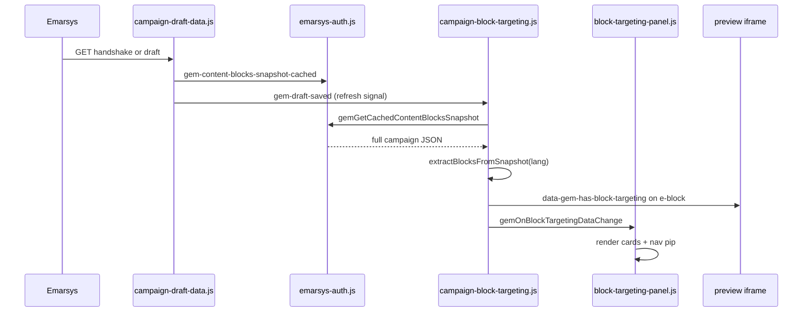

# Block Targeting

How Emarsys **Block Targeting** works in the campaign editor, where Gemma can read targeting state from APIs and the DOM, and how Gemma’s Block Targeting features use that data.

Use this document when extending overlays, the **Gemma Block Targeting** panel, counts/pips, or any feature that needs to know which blocks have audience rules applied.

Related docs:

- [review-links.md](./review-links.md) — same handshake snapshot shape; links ignore `blocks[].targeting` today
- [emarsys-body-persistence.md](./emarsys-body-persistence.md) — why the preview iframe is not the durable model

---

## What Block Targeting is

Block Targeting is an Emarsys campaign-editor feature that controls **whole-block visibility** per contact based on audience rules (segment, location, etc.). In the native UI:

- Each block can open a **Block targeting** dialog (`span.e-dialog__title` text: `Block targeting`).
- The user chooses **Show this block** or **Hide this block** for contacts matching the configured rule.
- Targeted blocks show a highlighted toolbar control (`[block-toolbar-button="block-targeting"]` with class `background-color-info`).

Gemma does not implement targeting rules. Gemma **reads** whether a block has targeting and surfaces that in the preview and in a side panel.

---

## Mental model: screen vs backpack

Same distinction as Review Links:

| Layer | What it is | Good for targeting? |
|-------|------------|---------------------|
| **Screen** | Preview iframe DOM (`iframe.e-contentblocks-preview__iframe-desktop`) | Overlays only — marks `[e-block]` elements after we already know targeting |
| **Backpack** | Campaign JSON from handshake/draft (`campaign.contents[lang].blocks[]`) | **Yes** — authoritative `blocks[].targeting` per language |

The preview iframe is rebuilt on language switch, save, and many editor actions. **Never treat toolbar CSS or iframe attributes as the only source of truth.**

```
Backpack (API)  ──►  Gemma in-memory block list  ──►  Preview overlay attributes
                           │
                           └──►  Gemma Block Targeting panel cards
```

---

## Where Emarsys exposes targeting data

### 1. Content-blocks handshake API (primary — full detail)

Emarsys loads this when opening the campaign editor. Gemma intercepts it passively.

```
GET https://content-blocks.gservice.emarsys.net/api/handshake/token/campaigns/{campaignId}
Authorization: Bearer {content-blocks JWT}
```

Intercepted in page **MAIN world** by:

- `extension/campaign-draft-data.js` — patches `fetch` / `XMLHttpRequest`
- `extension/content-blocks-fetch-bridge.js` — same pattern for Review Links

Cached on:

- `window.__gemContentBlocksSnapshots[campaignId]` (page world)
- `contentBlocksSnapshotCache` in `extension/emarsys-auth.js` (isolated world, via `gem-content-blocks-snapshot-cached` postMessage)

On-demand fetch from isolated world: `window.gemFetchContentBlocksSnapshot(campaignId, sessionId)` (`emarsys-auth.js`).

**Cache key note:** Handshake responses from draft saves may be keyed by `campaign.suite_campaign_id` while the URL uses `?id=`. Gemma tries both IDs when resolving cache (`getCachedSnapshot([urlId, suiteCampaignId])`).

### 2. Multilanguage draft API (same JSON shape)

```
/api/multilanguage-campaigns/{id}/draft
```

Also intercepted by `campaign-draft-data.js`. The response body is the **same campaign object shape** as handshake, including full `blocks[].targeting`. On each draft response Gemma:

1. Caches the **full** payload (`cacheSnapshotFromCampaignPayload`)
2. Posts `gem-content-blocks-snapshot-cached`
3. Posts `gem-draft-saved` (used as a “refresh now” signal — **not** as the authoritative targeting payload)

### 3. Per-block targeting in the campaign model

For each language in `campaign.contents[locale]`:

| Path | Role |
|------|------|
| `blocks[]._id` | Block instance id — matches `[e-block-id]` in preview |
| `blocks[].template` | Template id — used for block name fallback |
| `blocks[].targeting` | **Block targeting rules** (presence = block has targeting) |

Observed `targeting` shape (examples from production emails):

```json
{
  "content": {
    "visibility": "show"
  },
  "type": "segment"
}
```

```json
{
  "content": {
    "visibility": "hide"
  },
  "type": "location"
}
```

| Field | Meaning |
|-------|---------|
| `targeting.content.visibility` | `"show"` or `"hide"` — show/hide this block for matching contacts |
| `targeting.type` | Rule category (e.g. `segment`, `location`) — additional keys may exist for segment/list metadata |

Gemma overlay CSS only needs `targeting.content.visibility`. The **Gemma Block Targeting panel** displays all top-level `targeting` keys (with `type` label/value title-cased).

Template names for block labels:

`campaign.template_resources.available_block_templates[]` → `{ _id, name, … }`

### 4. DOM — preview iframe (overlay target)

Selector: `iframe.e-contentblocks-preview__iframe-desktop`

Inside iframe document:

| Selector | Use |
|----------|-----|
| `[e-blocks-container]` | Block list root |
| `[e-block][e-block-id="…"]` | One block instance — overlay target |
| `[e-block-name]`, `.e-blockname`, `.e-block-name` | Human-readable block name (when present) |

Gemma writes overlay state onto `[e-block]`:

| Attribute | Set when |
|-----------|----------|
| `data-gem-has-block-targeting="true"` | Block has `targeting` in model |
| `data-gem-block-targeting-visibility` | `"show"`, `"hide"`, or temporarily `"…"` |
| `data-gem-block-targeting-scroll-highlight="true"` | Brief highlight after scroll-from-panel |

### 5. DOM — block toolbar hint (fallback only)

When backpack data is not yet available, Gemma can infer **that** targeting exists (not show/hide) from the block toolbar:

| Selector | Signal |
|----------|--------|
| `[block-toolbar-button="block-targeting"]` | Block targeting toolbar button |
| `.background-color-info` on that button | Block has targeting applied |

Synthetic fallback sets `targeting.content.visibility` to `"…"` (Unicode ellipsis) until real data arrives.

### 6. DOM — Block targeting dialog (live edits, unsaved)

Native dialog title: `Block targeting` (`span.e-dialog__title`).

Gemma watches OK / **Remove Block Targeting** clicks and reads:

- Visibility from listbox `aria-label`: `Show this block` → `show`, `Hide this block` → `hide`
- Block id from `pendingBlockId` (captured on `[block-toolbar-button="block-targeting"]` click before dialog opens)

These updates apply **in memory only** until the next draft save. Dialog edits may only write `{ content: { visibility } }` — merge logic preserves richer `targeting` from snapshot when possible.

### 7. Language selection

Active language: `vce-languages-selector e-select-option[selected="true"]` → `value` attribute.

All targeting lists and overlays are **per active language**. Language change triggers `applyTargetingData()`.

---

## How Gemma uses targeting data

### Feature overview

| Feature | File | What it does |
|---------|------|--------------|
| Preview overlays | `campaign-block-targeting.js` | Colored inset border + show/hide badge on targeted `[e-block]` |
| Preview toolbar toggle | `campaign-block-targeting.js` | `#blockTargetingPreviewButton` (radio-checked icon) |
| **Gemma Block Targeting** panel | `block-targeting-panel.js` | Vertical nav tab + cards per targeted block |
| Nav count pip | `block-targeting-panel.js` | Neutral pip on `#gem-block-targeting-tab` (hidden at 0) |
| Settings | `settings-panel.js` | Preview on/off, always-show vs hover |
| Command palette | `command-palette.js` | Open Gemma Block Targeting tab |
| Compact email tools | `overlay-panel-controls.js` | “Highlight Targeting” toggle |

### Data resolution order

`applyTargetingData()` in `campaign-block-targeting.js`:

1. **Cached handshake / draft snapshot** — `gemGetCachedContentBlocksSnapshot` → `extractBlocksFromSnapshot` (full `targeting` + `template`)
2. **Wait / fetch snapshot** — `gemWaitForContentBlocksSnapshot`, then `gemFetchContentBlocksSnapshot`
3. **`chrome.storage.local`** — `gemDraft_{campaignId}` via `campaign-draft-data-loader.js` (stores `_id`, `template`, full `targeting`)
4. **Toolbar hints** — `background-color-info` buttons → synthetic blocks with visibility `"…"`

After **draft save**, `applyTargetingDataAfterDraftSave()` re-reads from the **full cached snapshot** (not the slim postMessage payload). See [Draft save pitfall](#draft-save-pitfall) below.

### End-to-end flow



### Block name resolution

`resolveBlockName()` order:

1. Preview iframe `[e-block-name]` / `.e-blockname` (cached in `blockDisplayNameCache` when found)
2. Cached display name (survives iframe rebuild after save)
3. Template name from `available_block_templates` via `block.template`
4. Fallback `Block {first 8 chars of _id}`

After save, preview names may be temporarily missing; cache + snapshot template prevent regression to ID-only labels.

### Panel card content

Each card (`gemGetTargetedBlocks()`) includes:

- `name` — resolved display name
- `visibility` — `show` / `hide` / `…`
- `rules[]` — formatted rows from `formatTargetingRules()` (Visibility + other `targeting` keys)
- Click → `gemScrollPreviewToBlock(_id)`

Panel header **Highlight Blocks** button (`e-btn e-section__action`) toggles overlays; hidden when count is 0.

---

## Code map

| Concern | File |
|---------|------|
| Overlay CSS injection, data pipeline, public API | `extension/campaign-block-targeting.js` |
| Vertical nav panel, cards, nav pip | `extension/block-targeting-panel.js` |
| Fetch/XHR intercept, snapshot cache, draft postMessage | `extension/campaign-draft-data.js` |
| Persist draft blocks to `chrome.storage.local` | `extension/campaign-draft-data-loader.js` |
| Snapshot cache in isolated world, on-demand fetch | `extension/emarsys-auth.js` |
| MAIN-world fetch bridge (shared with Review Links) | `extension/content-blocks-fetch-bridge.js` |
| Panel + card styles | `extension/css--campaign.css` |
| User settings | `extension/settings-panel.js` |

Load order (manifest): `campaign-block-targeting.js` then `block-targeting-panel.js`.

---

## Public API (isolated content-script world)

| Function | Returns / behavior |
|----------|-------------------|
| `gemGetTargetedBlocks()` | `{ _id, name, visibility, targeting, rules, index }[]` for active language |
| `gemGetBlockTargetingCount()` | Number of blocks with `targeting` |
| `gemOnBlockTargetingDataChange(cb)` | Subscribe; callback receives `{ blocks, targetedCount, language }` |
| `gemScrollPreviewToBlock(blockId)` | Scroll preview iframe to block; brief highlight |
| `gemToggleBlockTargetingPreview()` | Toggle overlay visibility (chrome.storage.sync) |
| `gemIsBlockTargetingPreviewEnabled()` | Boolean |
| `gemFormatBlockTargetingRules(targeting)` | `{ label, value }[]` for display |
| `gemActivateBlockTargetingPanel()` | Open vertical nav panel |
| `gemDeactivateBlockTargetingPanel()` | Close panel |
| `gemIsBlockTargetingActive()` | Panel open? |
| `gemSetBlockTargetingNavPipCount(n)` | Update nav pip (internal; called from BT module) |

Settings keys (`chrome.storage.sync`):

- `gemBlockTargetingPreviewEnabled` — default `true`
- `gemBlockTargetingVisibility` — `"always-show"` or `"show-on-hover"`

---

## Draft save pitfall

**Problem (fixed):** Early implementation applied **slimmed** blocks from `gem-draft-saved` postMessage, which only retained `targeting.content.visibility`. That overwrote rich handshake data and dropped `type`, segment metadata, and `template` — cards showed `Block 6a6948e1` and lost rule rows.

**Fix:**

- `gem-draft-saved` triggers `applyTargetingDataAfterDraftSave()` → re-extract from **full cached snapshot**
- `slimBlockForDraftStorage()` still strips bulky block fields for storage but keeps **full `targeting` + `template`**
- `mergeBlocksWithExisting()` preserves rich targeting when a visibility-only update arrives
- `blockDisplayNameCache` preserves friendly names across iframe rebuilds

**Rule for future changes:** Never apply slim postMessage block arrays as the runtime model. Always read from snapshot cache or `extractBlocksFromSnapshot`.

---

## Staleness and unsaved edits

| Scenario | Behavior |
|----------|----------|
| User edits targeting in dialog, does not save | In-memory update via dialog watcher; overlays/panel update immediately |
| User reloads without saving | Reverts to last saved snapshot / storage |
| Handshake cache lags unsaved body edits | Targeting in snapshot updates on draft save (same as Review Links) |
| Language switch | Re-run `applyTargetingData()` for new locale |

Unlike Review Links, Block Targeting does **not** auto-click Save draft before reading data. Overlays appear from handshake on load without requiring save first.

---

## Debugging

Enable **Settings → Enable debug logging**, then filter console for `[Gem][BlockTargeting]`.

Useful checks in DevTools on a campaign page:

```js
// Current in-memory targeted blocks for panel
window.gemGetTargetedBlocks()

// Count
window.gemGetBlockTargetingCount()

// Cached full snapshot (try URL id)
window.gemGetCachedContentBlocksSnapshot(new URL(location.href).searchParams.get('id'))

// Toggle overlays
window.gemToggleBlockTargetingPreview()
```

Log lines:

- `[Gem][BlockTargeting] Applied targeting to N of M blocks.` — overlay pass
- `[Gem][BlockTargeting][Debug] applyFromToolbarHints` — fell back to toolbar scraping
- `[Gem][DraftData] Draft response captured` — full snapshot cached on save

---

## Out of scope / not implemented

- Filtering Review Links by `targeting.content.visibility === 'hide'`
- Proactive draft-save before reading targeting (handshake on load is sufficient for overlays)
- Editing targeting rules from Gemma (native Emarsys dialog only)
- Mobile preview iframe overlays (desktop iframe selector only today)

---

## Quick reference: “Does this block have targeting?”

```
1. blocks[i].targeting exists in campaign.contents[lang].blocks   ← use this
2. Else [block-toolbar-button="block-targeting"].background-color-info   ← hint only
3. Never infer from preview overlay attributes alone   ← those are Gemma output
```

For **show vs hide**, read `targeting.content.visibility` from the backpack. For **rule type** (segment, location, …), read other keys on `targeting` from the full snapshot — not from the preview DOM.
