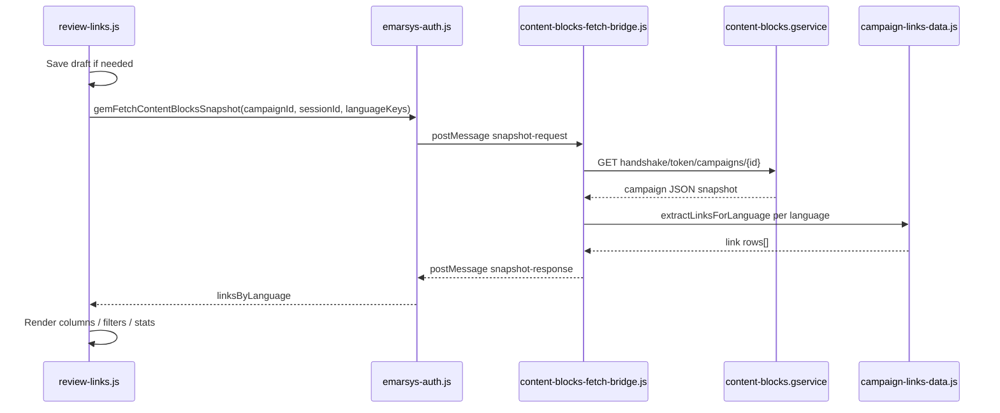

# Review Links

How Gemma’s **Review Links** feature builds its link table from Emarsys campaign data — and why it uses content-blocks snapshots instead of the live preview iframe.

## What Review Links does

Review Links is a side-by-side link audit view inside the campaign editor. It lists every URL Gemma believes will appear in the sent email for one or more **languages** or **A/B versions**, with metadata Gemma can infer from the snapshot:

| Column / chip | Meaning |
|---------------|---------|
| URL | Resolved `href` (template placeholder, content field, or locked template value) |
| Tracked / Untracked | Whether Emarsys link tracking applies |
| Lock icon | Template-only link (`locked: true`) — not driven by a block `*URL` content field |
| Associated text | Paired `*Text` field, anchor text, or image `alt` |
| Frequency | Optional duplicate URL count when “Combine identical URLs” is on |

Entry points:

- **Campaign menu → Review Links** (`review-links.js` → `gemOpenReviewLinksModal`)
- **Compare Languages** or **Compare Versions** modal → **Links** content view (same table UI)

Implementation: `review-links.js` (UI + fetch orchestration), `campaign-links-data.js` (extraction), `content-blocks-fetch-bridge.js` (MAIN-world snapshot fetch).

## Why not scrape the preview iframe?

Emarsys’s preview DOM is the **rendered** email for the **currently selected language** (and resolves `<e-optional>` branches at display time). Review Links needs to:

- Compare **multiple languages** or **versions** without switching the editor
- Read **configured** URLs from block `content` fields (not only what happens to be painted)
- Stay stable while the user toggles preview desktop/mobile or optional sections

So Gemma reads the **content-blocks campaign handshake snapshot** — the same JSON shape Emarsys uses for drafts — and derives links from `campaign.contents[lang].blocks[]` plus template resources.

**Screen** = preview iframe (render-time, single locale). **Backpack** = handshake snapshot (`campaign.contents`, `optionals`, `content` fields). Review Links reads the backpack.

## Emarsys data Gemma uses

### Snapshot source

Fetched in the page **MAIN world** via `content-blocks-fetch-bridge.js`:

```
GET https://content-blocks.gservice.emarsys.net/api/handshake/token/campaigns/{campaignId}
Authorization: Bearer {content-blocks token}
```

Token resolution order: cached `window.__gemContentBlocksAuthToken` → `uiKit.getAuthenticationToken('content-blocks')` → `bootstrap.php?r=frontendAuthentication/getToken`.

Successful responses are cached on `window.__gemContentBlocksSnapshots[campaignId]`. The isolated extension world requests extraction through `window.gemFetchContentBlocksSnapshot` (`emarsys-auth.js` → `postMessage` to the bridge).

Before fetch, Review Links may click **Save draft** (`prepareFreshLinkData`) so the handshake reflects the latest block settings.

### Per-language block model

For each `campaign.contents[locale]`:

| Path | Role |
|------|------|
| `blocks[]` | Ordered block instances in the email body |
| `blocks[]._id` | Block instance id |
| `blocks[].template` | Template id when HTML comes from `template_resources` |
| `blocks[].html` | Optional instance HTML override |
| `blocks[].content` | Map of field name → `{ value, attributes, link, … }` keyed by `e-editable` name |
| `blocks[].optionals` | Map of optional section label → `{ enabled: boolean }` |
| `blocks[].read_only_links` | Optional per-anchor tracking hints |
| `blocks[].targeting` | Whole-block visibility (not used for link extract today) |

Template HTML lives under:

`campaign.template_resources.available_block_templates[]` → `{ _id, html, optionals, … }`

Block HTML resolution (`resolveBlockHtml`): use `block.html` when present, else template `html` for `block.template`.

### Optional content (`<e-optional>`)

Article-style blocks declare swappable sections in template HTML:

```html
<e-optional name="11 Article CTA">
  … <a e-editable="article_CTAUrl">…</a> …
</e-optional>
<e-optional name="12 Article CTA No Button">
  … <a e-editable="article_CTANoButtonUrl">…</a> …
</e-optional>
```

On/off state is **not** on the tag. It lives in the snapshot:

```json
"optionals": {
  "11 Article CTA": { "enabled": true },
  "12 Article CTA No Button": { "enabled": false }
}
```

Preview hides disabled branches at render time. The snapshot **still contains** dormant branches in template HTML until Emarsys compiles the send body.

## Link extraction pipeline

All extraction lives in `campaign-links-data.js` → `extractLinksForLanguage(snapshot, lang)`.

For each block in `contents[lang].blocks`:

```
resolveBlockHtml(block)
  → collectDisabledOptionalEditables(rawHtml, optionals)   // string parse
  → stripInactiveOptionalBranches(rawHtml, optionals)        // DOM best-effort
  → filterContentForStrippedHtml(raw, stripped, content)
  → filterContentForDisabledOptionals(content, disabledEditables)
  → extractLinksFromBlockContent(html, content, readOnlyLinks, disabledEditables)
```

### Where links come from (`extractLinksFromBlockContent`)

1. **Anchors in block HTML** — `querySelectorAll('a[href]')`
   - If anchor has `e-editable` matching a `*URL` content field → use `field.attributes.href` (`locked: false`)
   - Else use template `href` on the tag (`locked: true`)
2. **Orphan `*URL` fields** — content fields ending in `URL` with `attributes.href` not consumed by an anchor walk
3. **`field.link` on image/text fields** — image wrapper links
4. **`field.value` HTML** — embedded `<a>` inside rich text fields

Tracking resolution considers `ems:notrack`, mailto / `#HTML_BROWSE_HREF#`, `read_only_links[]`, and URL field attributes.

Associated text: paired `*Text` field (replace `URL` → `Text`), anchor `textContent`, or image `alt`.

Rows are normalized in `finalizeLinkRows` (optional duplicate aggregation).

### Optional filtering (disabled branches)

Two layers — both driven by `blocks[].optionals`:

| Step | Mechanism | Why |
|------|-----------|-----|
| `collectDisabledOptionalEditables` | Regex: raw `<e-optional name="…">…</e-optional>` segments for `enabled === false`; collect every `e-editable="…"` inside | **Primary fix.** DOMParser reparents invalid table markup (`<e-optional><tr>…`) so removing the custom element can leave hoisted `<a>` tags behind. |
| `stripInactiveOptionalBranches` | DOMParser: remove `<e-optional>` nodes where `enabled === false` | Shrinks HTML; helps when structure parses cleanly |
| `filterContentForStrippedHtml` | Drop content keys whose `e-editable` existed in raw HTML but not in stripped HTML | Catches fields tied to removed DOM nodes |
| `filterContentForDisabledOptionals` | Drop content keys in the disabled-editable set | Catches orphan `*URL` fields when anchors survive DOM strip |
| `extractLinksFromBlockContent` | Skip anchors / fields whose `e-editable` is in the disabled set | Final guard at emit time |

`resolveBlockOptionals` uses `block.optionals` when present, else falls back to template `optionals` for template-only blocks.

**Not filtered today:** whole-block `targeting.content.visibility === 'hide'` (separate concern from optional sections).

## End-to-end request flow



### Compare modes

| Mode | Columns | Snapshot calls |
|------|---------|----------------|
| **Languages** | One per selected locale | Single campaign id; `languageKeys` = locale codes |
| **Versions** | One per A/B version | One handshake per version campaign id; `languageKeys: ['current']` |
| **Review Links only** | Current campaign, current language | Same as languages with `allowSingle: true` |

## UI behavior

Toolbar prefs persist in `chrome.storage.local` → `gemReviewLinksToolbarPrefs`:

- Combine identical URLs
- Filter by editable vs locked
- Filter by tracked vs untracked
- Show/hide associated text, frequency, totals

Hovering a row highlights other rows with the same URL across columns.

CSS: `css--compare-languages.css` (`.gem-review-links*` classes).

## Code map

| Concern | File |
|---------|------|
| Modal / table / toolbar / draft-save gate | `extension/review-links.js` |
| Link row extraction + optional filtering | `extension/campaign-links-data.js` |
| MAIN-world fetch + cache + `buildLinksByLanguage` | `extension/content-blocks-fetch-bridge.js` |
| Isolated-world `gemFetchContentBlocksSnapshot` | `extension/emarsys-auth.js` |
| Compare modal shell (Links view toggle) | `extension/compare-preview-common.js`, `compare-languages.js`, `compare-versions.js` |
| Slim draft storage (strips `optionals` — not used for Review Links fetch) | `extension/campaign-draft-data.js` |
| ESL body merge (same field shape; optional filter not applied there) | `campaign-links-data.js` → `buildBodyHtmlForLanguage` |

## Limits and known risks

- **Snapshot vs preview** — If handshake lags behind unsaved editor state, link counts can differ until draft save completes.
- **Optional DOM strip alone is insufficient** — Invalid `<e-optional><tr>` templates require string-based editable exclusion (see above).
- **Block targeting hide** — Hidden blocks may still contribute links until visibility filtering is added.
- **ESL / body HTML builders** — `buildBodyHtmlForLanguage` does not yet apply optional filtering; only Review Links extraction does.
- **Cached snapshots** — `forceRefresh: true` on Review Links open reduces staleness; cache still used elsewhere.

## Debug logging

Enable via Settings → **Enable debug logging** (or `gemSetDebugLogging(true, true)`).

- `[Gem][ReviewLinks] Snapshot fetch failed:` — handshake / bridge errors in `review-links.js` (`console.error`, always visible)

## Mental model (short)

**Preview** shows one rendered language with optionals resolved. **Review Links** walks the **handshake snapshot**: template HTML + per-block `content` + `optionals` map, then emits the URLs that would matter for QA — skipping editables belonging to disabled `<e-optional>` sections even when invalid HTML keeps stray anchors in a parsed DOM tree.
